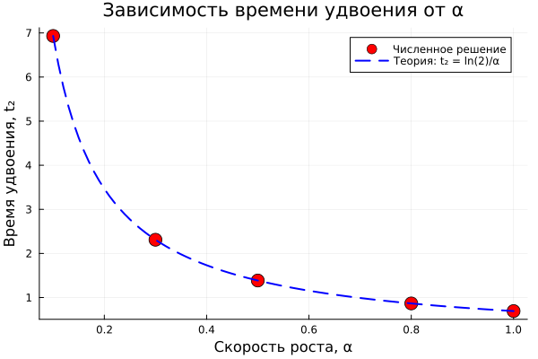

---
## Author
author:
  name: Метвалли Ахмед Фарг Набеех
  email: 1132255654@rudn.ru
  affiliation:
    - name: Российский университет дружбы народов
      country: Российская Федерация
      postal-code: 117198
      city: Москва
      address: ул. Миклухо-Маклая, д. 6
## Title
title: "Математическое моделирование"
subtitle: "Лабораторная работа № 1"
license: CC BY
date: today
date-format: "YYYY-MM-DD"
---

# Введение

## Цель работы

- Рассмотреть модель экспоненциального роста как пример динамической системы  
- Получить аналитическое решение дифференциального уравнения  
- Выполнить параметрическое исследование коэффициента роста $\alpha$  
- Проанализировать:
  - динамику функции $u(t)$  
  - зависимость времени удвоения $T_2$  
  - особенности вычислительных затрат  

## Постановка задачи

- Исследовать математическую модель экспоненциального роста  
- Проанализировать её поведение при различных значениях параметра $\alpha$  
- Провести вычислительные эксперименты  
- Представить результаты в графическом виде  

# Теоретические основы

## Математическая модель

Динамика системы описывается уравнением:

$$
\frac{du}{dt} = \alpha u
$$

Где:

- $u$ — исследуемая величина  
- $t$ — переменная времени  
- $\alpha$ — коэффициент роста  
  - $\alpha > 0$ — экспоненциальное увеличение  
  - $\alpha < 0$ — экспоненциальное убывание  

## Аналитическое решение

Решение уравнения имеет вид:

$$
u(t) = u_0 e^{\alpha t}
$$

Время удвоения определяется формулой:

$$
T_2 = \frac{\ln(2)}{\alpha}
$$

Особенности модели:

- темп роста определяется значением $\alpha$  
- при увеличении $\alpha$ система развивается быстрее  
- время удвоения обратно пропорционально $\alpha$  

# Вычислительный эксперимент

## Базовый расчёт (α = 0.3)

- Выполнено моделирование при фиксированном коэффициенте роста  
- Наблюдается ускоряющийся характер изменения функции  

{width=85%}

# Параметрический анализ

## Влияние коэффициента роста

- Рассмотрены значения:
  - $\alpha = 0.1,\;0.3,\;0.5,\;0.8,\;1.0$  
- С увеличением параметра кривые становятся более крутыми  
- Рост приобретает выраженный ускоренный характер  

{width=90%}

## Анализ времени удвоения

Теоретическая зависимость:

$$
T_2 = \frac{\ln(2)}{\alpha}
$$

- Численные результаты подтверждают формулу  
- При росте $\alpha$ значение $T_2$ уменьшается  

{width=85%}

## Анализ вычислительных затрат

- Исследована зависимость времени расчёта от параметра роста  
- Существенного влияния $\alpha$ на длительность вычислений не выявлено  

{width=85%}

# Заключение

## Основные результаты

- Модель экспоненциального роста корректно описывает ускоряющиеся процессы  
- Коэффициент $\alpha$ определяет интенсивность изменения системы  
- Время удвоения уменьшается при увеличении параметра  
- Вычислительные затраты зависят от $\alpha$ незначительно  

Проведённый анализ подтверждает теоретические выводы и демонстрирует практическую применимость модели.

