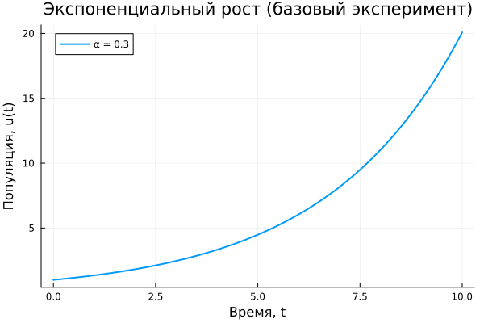
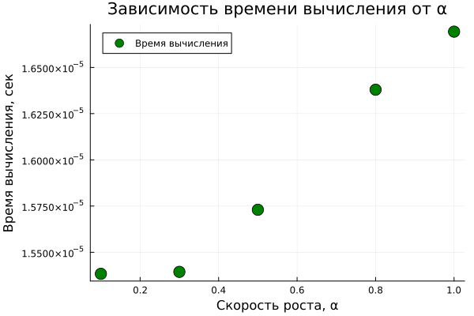

---
## Author
author:
  name: Метвалли Ахмед Фарг Набеех
  email: 1132255654@rudn.ru
  affiliation:
    - name: Российский университет дружбы народов
      country: Российская Федерация
      postal-code: 117198
      city: Москва
      address: ул. Миклухо-Маклая, д. 6

## Title
title: "Математическое моделирование"
subtitle: "Лабораторная работа № 1"
license: "CC BY"
---

# Цель работы

Проанализировать модель экспоненциального роста, рассмотреть её формальное математическое представление, получить аналитическое решение соответствующего дифференциального уравнения и исследовать влияние коэффициента роста на динамику системы. Освоить приёмы параметрического анализа и интерпретации результатов численного моделирования.

# Задание

В рамках лабораторной работы требуется рассмотреть модель экспоненциального роста как базовый пример динамической системы. Необходимо исследовать математическую формулировку модели, изучить решение дифференциального уравнения, а также выполнить параметрический анализ, отражающий влияние коэффициента роста на характер изменения величины, время удвоения и вычислительные показатели.

# Теоретическое введение

Экспоненциальный рост представляет собой процесс, при котором скорость изменения величины пропорциональна её текущему значению. Это означает, что по мере увеличения самой величины возрастает и темп её роста.

Подобная зависимость наблюдается, например, при начислении сложных процентов или при лавинообразных процессах, когда увеличение масштаба приводит к ускорению дальнейшего развития.

Математическая модель задаётся дифференциальным уравнением:

$$
\frac{du}{dt} = \alpha u
$$

где:  
— $$u$$ — значение исследуемой величины (например, численность популяции, объём капитала, количество инфицированных);  
— $$t$$ — независимая переменная времени;  
— $$\frac{du}{dt}$$ — скорость изменения;  
— $$\alpha$$ — коэффициент роста (мальтузианский параметр).  

При $$\alpha > 0$$ система демонстрирует рост, а при $$\alpha < 0$$ — экспоненциальное убывание.

Суть модели заключается в линейной зависимости скорости изменения от текущего состояния системы.

Решение уравнения имеет следующий аналитический вид:

$$
u(t) = u_0 e^{\alpha t}
$$

где $$u_0$$ — начальное значение функции.

## Ключевые характеристики модели

— Рост с постоянным временем удвоения.  
— Время удвоения определяется выражением:

$$
T_2 = \frac{\ln(2)}{\alpha} \approx \frac{0.693}{\alpha}
$$

— Значение $$T_2$$ зависит исключительно от параметра роста и не определяется текущим состоянием системы.

## Области применения

— Биология: увеличение численности микроорганизмов при отсутствии ограничений.  
— Финансовая сфера: накопление средств при начислении сложных процентов.  
— Эпидемиология: ранняя фаза распространения инфекции.  
— Демография: периоды интенсивного прироста населения.  
— Физика: развитие цепных реакций.  
— Информационные технологии: рост объёмов данных и вычислительных ресурсов.

## Ограничения модели

Модель экспоненциального роста носит идеализированный характер. В реальных условиях рост ограничивается ресурсами и внешними факторами. Со временем система переходит к замедленному режиму развития, который описывается логистической зависимостью.

# Выполнение лабораторной работы

В процессе выполнения работы проведено численное моделирование экспоненциального роста на основе полученного аналитического решения.

На первом этапе рассмотрен базовый случай при фиксированном значении коэффициента $$\alpha = 0.3$$. Построенный график иллюстрирует зависимость величины от времени и отражает характерное ускорение роста.

{#fig-base width=80%}

В начальный момент времени функция возрастает относительно плавно, однако по мере увеличения аргумента темп роста заметно усиливается, что приводит к резкому увеличению значений на конечном интервале.

Далее выполнено параметрическое исследование, направленное на оценку влияния коэффициента $$\alpha$$ на динамику системы. Для анализа построены графики при различных значениях параметра.

{#fig-param width=85%}

Сравнение кривых показывает, что увеличение $$\alpha$$ приводит к значительному ускорению роста. При малых значениях параметра изменение происходит постепенно, тогда как при больших — функция стремительно возрастает.

Дополнительно исследована зависимость времени удвоения от коэффициента роста. Теоретическая формула $$T_2 = \ln(2)/\alpha$$ была проверена численно.

{#fig-double width=80%}

График подтверждает обратную зависимость: с увеличением $$\alpha$$ время удвоения сокращается, что полностью соответствует аналитическому выводу.

Также выполнен анализ зависимости времени вычислений от значения параметра роста.

{#fig-time width=80%}

Зафиксировано незначительное увеличение вычислительных затрат при росте $$\alpha$$. Это связано с возрастанием численных значений функции и особенностями обработки данных в ходе моделирования.

Для реализации вычислений и построения графиков использовались внешние программные модули:





Проведённый анализ позволил детально оценить влияние коэффициента роста на поведение системы, время удвоения и вычислительные характеристики модели.

# Выводы

В ходе выполнения лабораторной работы исследована модель экспоненциального роста и рассмотрено её математическое представление. Проанализировано дифференциальное уравнение, описывающее динамику процесса, и получено его аналитическое решение.

Построен базовый график, демонстрирующий ускоряющийся характер изменения величины во времени. Проведён параметрический анализ, выявивший существенное влияние коэффициента $$\alpha$$ на скорость роста.

Подтверждена теоретическая формула для времени удвоения: при увеличении значения $$\alpha$$ наблюдается сокращение $$T_2$$. Оценка вычислительных затрат показала слабую зависимость времени расчёта от параметра роста.

Полученные результаты согласуются с теоретическими положениями и подтверждают применимость модели для описания процессов в различных предметных областях.

# Список литературы{.unnumbered}

1. A Multi-Language Computing Environment for Literate Programming and Reproducible Research / E. Schulte [et al.] // Journal of Statistical Software. — 2012. — Vol. 46, no. 3. — ISSN 1548-7660. — DOI: 10.18637/jss.v046.i03.

2. Knuth D. E. Literate Programming // The Computer Journal. — 1984. — Feb. — Vol. 27, no. 2. — P. 97–111. — ISSN 1460-2067. — DOI: 10.1093/comjnl/27.2.97.

3. The Story in the Notebook / M. B. Kery [et al.] // Proceedings of the 2018 CHI Conference on Human Factors in Computing Systems. — ACM, 04/2018. — P. 1–11. — DOI: 10.1145/3173574.3173748.

