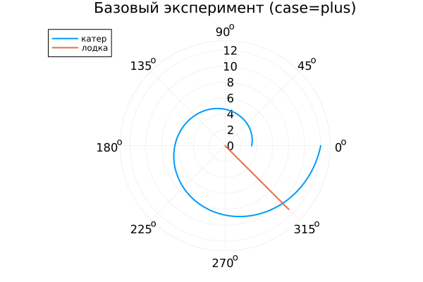
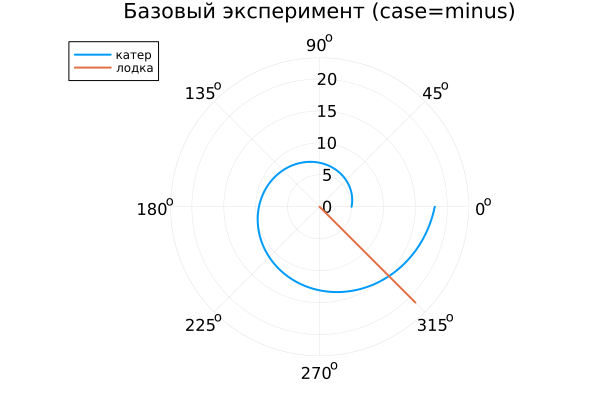

---
## Author
author:
  name: Метвалли Ахмед Фарг Набеех
  email: 1132255654@rudn.ru
  affiliation:
    - name: Российский университет дружбы народов
      country: Российская Федерация
      postal-code: 117198
      city: Москва
      address: ул. Миклухо-Маклая, д. 6

## Title
title: "Математическое моделирование"
subtitle: "Лабораторная работа № 2"
license: "CC BY"
date: today
date-format: "YYYY-MM-DD"
---

# Вводная часть

## Цель работы

Исследовать построение математической модели задачи преследования и определить стратегию движения, обеспечивающую гарантированный перехват.

Рассматривается ситуация: в условиях тумана катер береговой охраны преследует лодку браконьеров. В момент прояснения лодка фиксируется на расстоянии $k$ км от катера. Затем она вновь скрывается и продолжает движение по прямой в неизвестном направлении. Известно, что скорость катера превышает скорость лодки в $n$ раз. Необходимо определить траекторию катера, обеспечивающую встречу.

## Задание

1. Обосновать модель и вывести систему дифференциальных уравнений при соотношении скоростей $n:1$.
2. Построить траектории катера и лодки для двух вариантов начальных условий.
3. По графикам определить момент и точку перехвата.

# Теоретическая часть

## Выбор системы координат и начальные условия

Положим $t_0 = 0$ — момент обнаружения лодки.

В этот момент:

- лодка находится в начале координат: $X_0 = 0$;
- катер расположен на расстоянии $k$ от неё.

Для описания движения переходим к полярной системе координат:

- полюс совпадает с точкой обнаружения лодки;
- полярная ось $r$ направлена через начальное положение катера.

## Определение радиуса перехода

Найдём расстояние $x$, при котором катер и лодка оказываются на одинаковом расстоянии от полюса.

За время $t$ лодка проходит путь $x$, а катер — либо $x-k$, либо $x+k$ (в зависимости от конфигурации).

Приравнивая времена движения, получаем два варианта начальных условий:

- **case = plus**
  $$
  x_1=\frac{k}{n+1}, \quad \theta_0=0;
  $$

- **case = minus**
  $$
  x_2=\frac{k}{n-1}, \quad \theta_0=-\pi.
  $$

## Формирование системы уравнений

После достижения одинакового радиуса катер должен двигаться так, чтобы его радиальная скорость совпадала со скоростью лодки.

Разложим скорость катера на компоненты:

- радиальная: $\frac{dr}{dt}$,
- тангенциальная: $r\frac{d\theta}{dt}$.

С учётом модуля скорости $n\upsilon$ получаем систему:

$$
\begin{cases}
\frac{dr}{dt}=\upsilon, \\
r\frac{d\theta}{dt}=\upsilon\sqrt{n^2-1}.
\end{cases}
$$

Исключая параметр времени, приходим к уравнению траектории:

$$
\frac{dr}{d\theta}=\frac{r}{\sqrt{n^2-1}}.
$$

Следовательно, траектория катера в полярных координатах представляет собой экспоненциально расходящуюся спираль.

# Численный эксперимент

## Исходные данные

Для моделирования приняты параметры:

- расстояние обнаружения: $k = 20$ км;
- отношение скоростей: $n = 5$.

Цель моделирования — построить траектории и определить точку пересечения.

## Базовый эксперимент: case = plus

### Анализ

- траектория катера имеет вид спирали;
- радиус $r$ возрастает при увеличении $\theta$;
- траектория лодки в полярных координатах представляется лучом.

## Базовый эксперимент: case = minus

### Анализ

- стартовый радиус больше, чем в предыдущем случае;
- форма спирали сохраняется;
- изменяется масштаб траектории, но не её характер.

# Параметрическое исследование

## Влияние параметра $n$

Из уравнения

$$
\frac{dr}{d\theta}=\frac{r}{\sqrt{n^2-1}}
$$

следует, что коэффициент роста равен $1/\sqrt{n^2-1}$.

Отсюда:

- при меньших $n$ радиус увеличивается быстрее;
- при больших $n$ спираль становится более пологой;
- изменение $n$ влияет на темп роста, но не на тип траектории.

## Метрика scale_ratio

Введём показатель относительного масштаба:

$$
\text{scale\_ratio}=\frac{r_{\text{final}}}{\max(r_{\text{boat}})}.
$$

### Интерпретация

- при малых $n$ значение существенно превышает 1;
- с ростом $n$ наблюдается уменьшение показателя;
- при больших $n$ масштабы становятся близкими.

Для режима case=minus значения выше из-за увеличенного начального радиуса.

## Оценка времени вычислений

### Результаты

- среднее время решения составляет порядка $6\times10^{-4}$ сек;
- зависимость от параметра $n$ практически отсутствует;
- небольшие колебания объясняются адаптивной процедурой интегрирования.

# Итоговая часть

## Основные выводы

1. Движение катера в полярных координатах описывается экспоненциальной спиралью.
2. Параметр $n$ регулирует скорость изменения радиуса по углу.
3. Различие начальных условий влияет на масштаб, но не меняет качественную структуру траектории.
4. Численный метод демонстрирует устойчивость и низкие вычислительные затраты.
