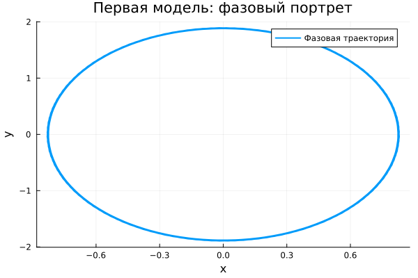
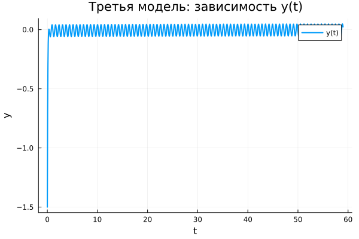

---
## Author
author:
  name: Метвалли Ахмед Фарг Набеех
  email: 1132255654@rudn.ru
  affiliation:
    - name: Российский университет дружбы народов
      country: Российская Федерация
      postal-code: 117198
      city: Москва
      address: ул. Миклухо-Маклая, д. 6

## Title
title: "Математическое моделирование"
subtitle: "Лабораторная работа № 4"
license: "CC BY"
date: today
date-format: "YYYY-MM-DD"
---

# Вводная часть

## Цель работы

Рассмотреть модель гармонического осциллятора и проанализировать её динамику в различных режимах функционирования:

1. без учета затухания;
2. при наличии затухания;
3. при наличии затухания и внешнего воздействия.

## Задание

1. Найти решение уравнения осциллятора без потерь энергии.  
2. Исследовать уравнение с затуханием и получить его решение.  
3. Построить фазовые портреты для затухающего движения.  
4. Рассмотреть систему с внешней силой.  
5. Получить решения и фазовые траектории для вынужденных колебаний.  

# Теоретические сведения

## Гармонический осциллятор

Линейный гармонический осциллятор служит универсальной моделью для описания множества процессов различной природы.

Общее уравнение имеет вид:

$$
\ddot{x} + 2\gamma \dot{x} + \omega_0^2 x = F(t)
$$

где:

- $x$ — фазовая переменная;
- $\gamma$ — коэффициент диссипации;
- $\omega_0$ — собственная частота системы;
- $F(t)$ — внешнее воздействие.

## Осциллятор без затухания

В случае отсутствия потерь энергии получаем:

$$
\ddot{x} + \omega_0^2 x = 0
$$

Система является консервативной, а движение носит периодический характер.

## Осциллятор с затуханием

При наличии сопротивления или трения:

$$
\ddot{x} + 2\gamma \dot{x} + \omega_0^2 x = 0
$$

Энергия убывает, что приводит к постепенному исчезновению колебаний.

## Осциллятор с внешней силой

При добавлении внешнего воздействия:

$$
\ddot{x} + 2\gamma \dot{x} + \omega_0^2 x = F(t)
$$

Даже при затухании система может сохранять колебательный режим за счёт подпитки энергией извне.

# Переход к системе первого порядка

## Без затухания

$$
\begin{cases}
\dot{x} = y \\
\dot{y} = -\omega_0^2 x
\end{cases}
$$

## С затуханием

$$
\begin{cases}
\dot{x} = y \\
\dot{y} = -2\gamma y - \omega_0^2 x
\end{cases}
$$

## С внешней силой

$$
\begin{cases}
\dot{x} = y \\
\dot{y} = F(t) - 2\gamma y - \omega_0^2 x
\end{cases}
$$

## Начальные условия

Во всех экспериментах использовались:

$$
x_0 = 0.5, \quad y_0 = -1.5
$$

Временной интервал:

$$
t \in [0;59]
$$

Шаг численного интегрирования:

$$
h = 0.05
$$

# Постановка задачи

## Модель 1

$$
\ddot{x} + 5.2x = 0
$$

## Модель 2

$$
\ddot{x} + 14\dot{x} + 0.5x = 0
$$

## Модель 3

$$
\ddot{x} + 13\dot{x} + 0.3x = 0.8\sin(9t)
$$

# Базовые эксперименты

## Первая модель: решение

## Первая модель: фазовый портрет

## Первая модель: анализ

Первая модель демонстрирует устойчивый колебательный режим без изменения амплитуды.

Характерные особенности:

- колебания регулярны и периодичны;
- амплитуда не уменьшается;
- энергия сохраняется;
- фазовая траектория замкнута.

Это соответствует идеальной системе без потерь.

## Вторая модель: решение

## Вторая модель: фазовый портрет

## Вторая модель: анализ

Во второй модели наблюдается быстрое затухание движения.

Особенности:

- переменная быстро уменьшается;
- система стремится к равновесию;
- колебания исчезают;
- фазовая траектория сходится к точке.

Движение носит апериодический характер.

## Третья модель: решение

## Третья модель: фазовый портрет

## Третья модель: анализ

В третьем случае затухание компенсируется внешней силой.

Наблюдается:

- наличие установившихся колебаний;
- малая, но устойчивая амплитуда;
- отсутствие полного затухания;
- ограниченная область фазового пространства.

Система выходит на режим вынужденных колебаний.

# Параметрическое исследование

## Траектории $x(t)$

## Анализ $x(t)$

Результаты варьирования параметров:

- первая модель: изменение частоты;
- вторая модель: изменение скорости затухания;
- третья модель: изменение параметров вынужденных колебаний.

## Траектории $y(t)$

## Анализ $y(t)$

Наблюдаются следующие закономерности:

- устойчивые колебания в первой модели;
- быстрое затухание во второй;
- поддерживаемые колебания в третьей.

# Анализ вычислений

## Время выполнения

## Интерпретация

Сравнение показало:

- первая модель — наименее затратная;
- вторая — немного сложнее;
- третья — наиболее ресурсоёмкая.

Во всех случаях вычисления выполняются эффективно.

# Анализ итоговой метрики

## Определение

$$
\text{norm\_final} = \sqrt{x(t_{final})^2 + y(t_{final})^2}
$$

## Зависимость

## Интерпретация

Полученные данные показывают:

- первая модель сохраняет ненулевое значение;
- вторая стремится к нулю;
- третья стабилизируется на малом уровне.

Метрика позволяет различить характер динамики.

# Итоги

## Выводы

1. Система без затухания сохраняет периодические колебания.  
2. При наличии затухания происходит переход к покою.  
3. Внешнее воздействие приводит к установившимся колебаниям.  
4. Параметры влияют на динамические характеристики системы.  
5. Численные методы обеспечивают быстрое решение.  
6. Метрика $\text{norm\_final}$ отражает тип режима движения.
