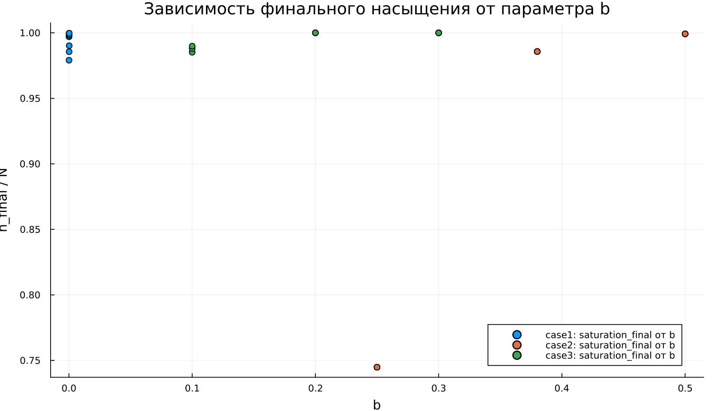

---
author:
  name: Метвалли Ахмед Фарг Набеех
  email: 1132255654@rudn.ru
  affiliation:
    - name: Российский университет дружбы народов
      country: Российская Федерация
      city: Москва
title: "Математическое моделирование"
subtitle: "Лабораторная работа №7"
license: "CC BY"
date: today
date-format: "YYYY-MM-DD"
---

# Вводная часть

## Цель работы

Исследовать модель эффективности рекламы и проанализировать процесс распространения информации о товаре среди потенциальных покупателей.

## Задание

1. Рассмотреть математическую модель рекламной кампании.
2. Построить графики распространения информации для трёх вариантов модели.
3. Проанализировать скорость изменения числа информированных покупателей.
4. Выполнить параметрическое исследование.
5. Сравнить динамику трёх моделей.

# Теоретические сведения

## Модель распространения рекламы

Пусть:

- $N$ — общее количество потенциальных покупателей;
- $n(t)$ — число покупателей, уже знающих о товаре;
- $t$ — время от начала рекламной кампании;
- $\frac{dn}{dt}$ — скорость распространения информации.

## Основная идея модели

Информация о товаре распространяется за счёт двух механизмов:

1. внешней рекламной кампании;
2. общения покупателей между собой.

Общий вид модели:

$$
\frac{dn}{dt} =
(\alpha_1(t) + \alpha_2(t)n(t))(N - n(t)).
$$

## Смысл множителей

Множитель $(N - n(t))$ задаёт число покупателей, которые ещё не знают о товаре.

Когда $n(t)$ приближается к $N$, выполняется:

$$
N - n(t) \rightarrow 0.
$$

Поэтому скорость распространения информации постепенно уменьшается.

## Уровень насыщения

Величина $N$ является предельным уровнем насыщения:

$$
n(t) \rightarrow N.
$$

Если $n = N$, то вся потенциальная аудитория уже информирована, а дальнейшее распространение рекламы прекращается.

# Постановка задачи

## Исходные данные

Заданы параметры:

$$
N = 609,
$$

$$
n(0) = 4.
$$

Необходимо построить графики $n(t)$ и $\frac{dn}{dt}$ для трёх моделей распространения рекламы.

## Первая модель

$$
\frac{dn}{dt} =
(0.54 + 0.00016n(t))(N - n(t)).
$$

В первой модели основной вклад в рост числа информированных покупателей вносит внешняя реклама.

## Вторая модель

$$
\frac{dn}{dt} =
(0.000021 + 0.38n(t))(N - n(t)).
$$

Во второй модели главным фактором становится распространение информации между самими покупателями.

## Третья модель

$$
\frac{dn}{dt} =
(0.2\cos t + 0.2\cos(2t)n(t))(N - n(t)).
$$

В третьей модели интенсивность распространения зависит от времени.

# Базовые эксперименты

## Первая модель: динамика $n(t)$

## Первая модель: скорость изменения

## Первая модель: фазовая траектория

## Анализ первой модели

Для первой модели характерен монотонный рост $n(t)$.

Основные особенности:

- $n(t)$ постепенно приближается к уровню $N = 609$;
- наибольшая скорость наблюдается в начале процесса;
- затем рост замедляется;
- решение не превышает уровень насыщения.

## Вывод по первой модели

Первая модель описывает насыщаемый рост.

При приближении к $N$ множитель $(N - n)$ уменьшается, поэтому:

$$
\frac{dn}{dt} \rightarrow 0.
$$

Состояние $n = N$ является равновесным.

# Вторая модель

## Вторая модель: динамика $n(t)$

## Вторая модель: скорость изменения

## Вторая модель: фазовая траектория

## Анализ второй модели

Во второй модели рост происходит значительно быстрее.

График $n(t)$ имеет S-образный вид:

- сначала рост остаётся умеренным;
- затем скорость быстро увеличивается;
- после достижения максимума рост замедляется;
- решение приближается к $N$.

## Максимальная скорость

Скорость распространения рекламы имеет один выраженный максимум.

Это связано с действием двух противоположных факторов:

- множитель $bn$ усиливает распространение информации;
- множитель $(N - n)$ ограничивает дальнейший рост.

Максимум скорости достигается внутри интервала изменения $n$.

## Расчёт максимума скорости

Для второй модели:

$$
f(n) = (a + bn)(N - n),
$$

где:

$$
a = 0.000021,\quad b = 0.38,\quad N = 609.
$$

Максимум определяется из условия:

$$
f'(n) = 0.
$$

Получаем:

$$
f'(n) = bN - a - 2bn.
$$

Следовательно:

$$
n_* = \frac{bN - a}{2b}.
$$

## Численное значение максимума

После подстановки параметров:

$$
n_* =
\frac{0.38 \cdot 609 - 0.000021}{2 \cdot 0.38}
\approx 304.5.
$$

Момент времени максимальной скорости:

$$
t_* \approx 0.0217.
$$

Значит, во второй модели реклама распространяется быстрее всего примерно при:

$$
t \approx 0.0217.
$$

# Третья модель

## Третья модель: динамика $n(t)$

## Третья модель: скорость изменения

## Третья модель: фазовая траектория

## Анализ третьей модели

Третья модель также приводит к насыщению.

Её особенность состоит в наличии периодических множителей:

$$
\cos t,\quad \cos(2t).
$$

На выбранном коротком интервале они остаются положительными, поэтому решение не переходит к колебательному режиму.

## Вывод по третьей модели

Третья модель описывает насыщаемый рост с переменными коэффициентами.

Несмотря на наличие тригонометрических функций, общий характер динамики сохраняется:

$$
n(t) \rightarrow N.
$$

# Сравнение базовых моделей

## Качественное различие

| Характеристика | case1 | case2 | case3 |
|---|---|---|---|
| Вид роста | монотонный | S-образный | S-образный |
| Скорость в начале | максимальная | небольшая | небольшая |
| Максимум $\frac{dn}{dt}$ | в начале | внутри интервала | внутри интервала |
| Предельное значение | $N$ | $N$ | $N$ |
| Коэффициенты | постоянные | постоянные | зависят от времени |

## Общая особенность

Во всех трёх моделях присутствует множитель:

$$
N - n(t).
$$

Он отвечает за насыщение и не позволяет числу информированных покупателей расти неограниченно.

# Параметрическое исследование

## Зависимость $n_{final}$ от параметра $a$

## Анализ зависимости $n_{final}(a)$

Большинство точек расположено около уровня $N = 609$.

Это показывает, что при большей части наборов параметров система успевает приблизиться к насыщению.

Отклонение заметно во второй модели при малом значении параметра $a$.

## Зависимость $n_{final}$ от параметра $b$

## Анализ зависимости $n_{final}(b)$

Параметр $b$ определяет вклад общения покупателей в распространение информации.

При увеличении $b$ рекламная информация распространяется быстрее.

Если значение $b$ недостаточно велико, система может не успеть достичь насыщения за заданное время.

# Максимальные значения

## Зависимость $n_{max}$ от параметра $a$

## Зависимость $n_{max}$ от параметра $b$

## Анализ $n_{max}$

Так как решения в базовых экспериментах возрастают монотонно, величина $n_{max}$ почти совпадает с $n_{final}$.

Если модель выходит на насыщение, то:

$$
n_{max} \approx N.
$$

Если времени моделирования недостаточно, значение $n_{max}$ остаётся ниже $N$.

# Финальное насыщение

## Зависимость насыщения от параметра $a$

## Зависимость насыщения от параметра $b$

## Метрика насыщения

Для оценки использовалась метрика:

$$
\text{saturation\_final} =
\frac{n_{final}}{N}.
$$

Если значение близко к $1$, то система почти достигла уровня насыщения.

## Интерпретация насыщения

Для большинства экспериментов выполняется:

$$
\frac{n_{final}}{N} \approx 1.
$$

Это соответствует почти полному охвату аудитории.

Пониженные значения означают, что процесс распространения информации ещё не завершился.

# Бенчмаркинг

## Время решения от параметра $a$

## Время решения от параметра $b$

## Анализ времени вычислений

Бенчмаркинг показал:

- все три модели решаются быстро;
- время вычислений имеет порядок $10^{-5}$ секунды;
- изменение параметров почти не влияет на вычислительную сложность;
- третья модель немного сложнее из-за вычисления $\cos t$ и $\cos(2t)$.

# Итоги

## Основные результаты

1. Все три модели описывают насыщаемый рост.
2. Предельный уровень равен $N = 609$.
3. В первой модели максимальная скорость наблюдается в начале процесса.
4. Вторая модель демонстрирует наиболее резкий S-образный рост.
5. Третья модель учитывает зависимость коэффициентов от времени.
6. Для второй модели максимум скорости достигается при $t \approx 0.0217$.

## Выводы

1. Первая модель (case1) описывает монотонное приближение $n(t)$ к уровню $N$.

2. Вторая модель (case2) демонстрирует S-образный рост и имеет внутренний максимум скорости распространения рекламы.

3. Третья модель (case3) также приводит к насыщению, но использует коэффициенты, зависящие от времени.

4. Параметры $a$ и $b$ определяют скорость выхода системы к насыщению.

5. Метрики $n_{final}$, $n_{max}$ и $\text{saturation\_final}$ позволяют количественно сравнить результаты моделирования.

6. Численное решение всех трёх моделей выполняется эффективно.

# Список литературы {.unnumbered}

1. [Модель Мальтуса](http://km.mmf.bsu.by/courses/2018/mathmod1/MM_LB1_Population_2019.pdf)
2. [Логистическая модель роста](https://studopedia.ru/29_5129_logisticheskaya-model-rosta.html)
