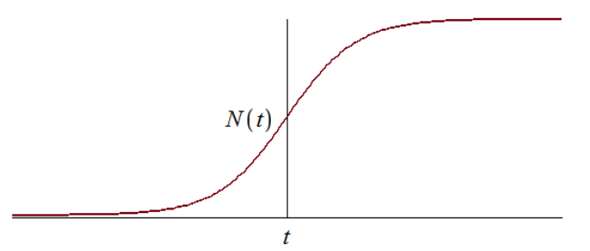
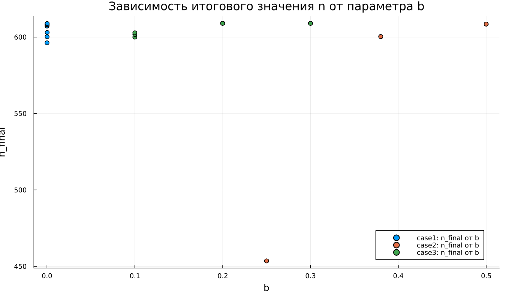
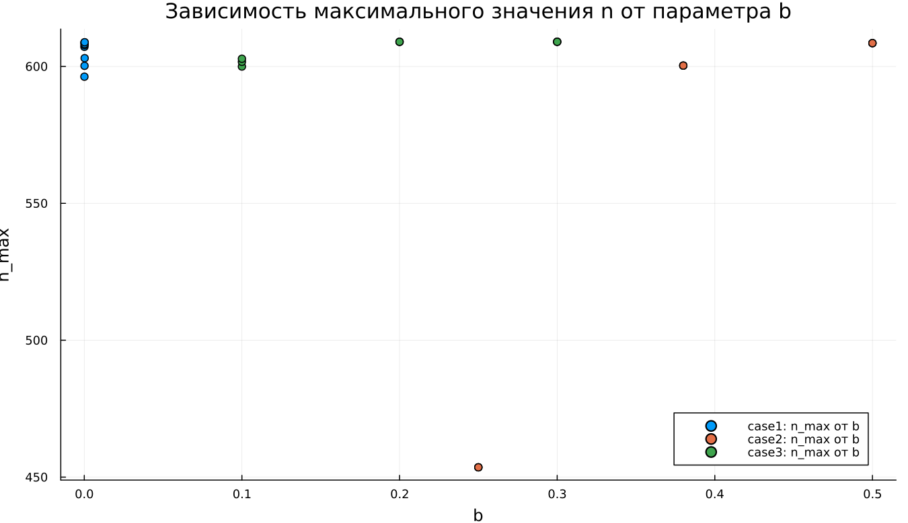
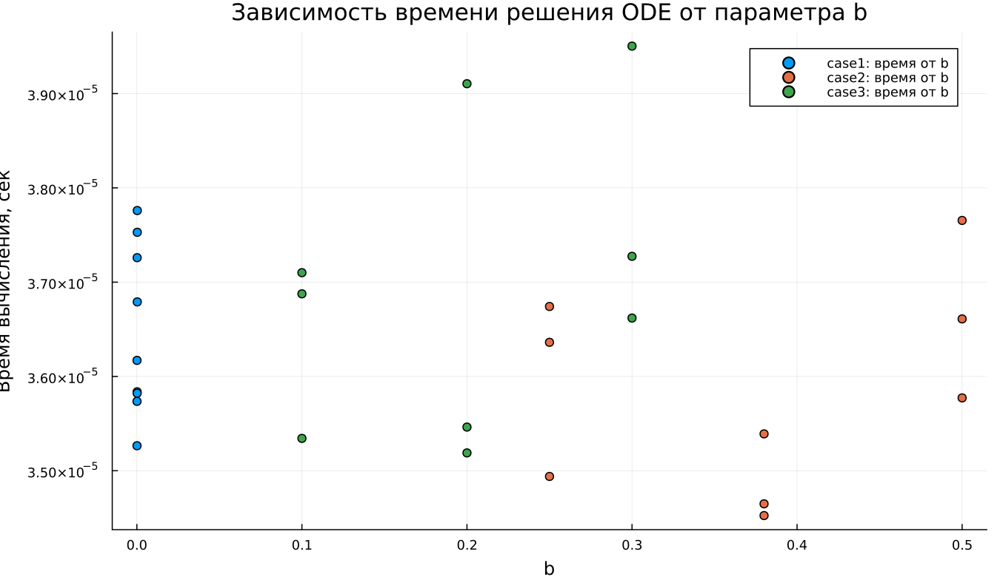

---
## Author
author:
  name: Метвалли Ахмед Фарг Набеех
  email: 1132255654@rudn.ru
  affiliation:
    - name: Российский университет дружбы народов
      country: Российская Федерация
      postal-code: 117198
      city: Москва
      address: ул. Миклухо-Маклая, д. 6

## Title
title: "Математическое моделирование"
subtitle: "Лабораторная работа № 7"
license: "CC BY"
---

# Цель работы

Исследовать математическую модель эффективности рекламной кампании.

# Задание

1. Изучить модель распространения рекламы.
2. Построить графики изменения числа информированных покупателей для заданных случаев.
3. Для второго случая определить момент времени, когда скорость распространения рекламы достигает максимума.

# Выполнение лабораторной работы

## Теоретические сведения

Рассматривается рекламная кампания, направленная на продвижение нового товара или услуги. Главная практическая цель состоит в том, чтобы будущая прибыль от продаж превысила расходы на рекламу. В начале кампании затраты могут быть выше прибыли, поскольку о продукте знает лишь небольшая часть потенциальной аудитории. По мере распространения информации число покупателей растёт, прибыль увеличивается, а затем рынок постепенно приближается к насыщению. После этого дальнейшее рекламирование теряет эффективность.

Пусть торговая организация реализует некоторый товар. В момент времени $t$ из общего числа потенциальных покупателей $N$ о товаре знают $n(t)$ человек. Для увеличения продаж запускается реклама через радио, телевидение и другие каналы массовой коммуникации. После начала кампании сведения о товаре распространяются не только через рекламные объявления, но и через общение покупателей между собой.

Обозначим:

- $\frac{dn}{dt}$ — скорость изменения числа потребителей, узнавших о товаре и готовых приобрести его;
- $t$ — время, прошедшее с начала рекламной кампании;
- $N$ — общее количество потенциальных платёжеспособных покупателей;
- $n(t)$ — число уже информированных клиентов.

Вклад внешней рекламы пропорционален количеству покупателей, которые ещё не знают о товаре. Он описывается выражением

$$
\alpha_1(t)(N - n(t)),
$$

где $\alpha_1(t) > 0$ характеризует интенсивность рекламной кампании и зависит от текущих затрат на продвижение.

Кроме внешней рекламы, информацию распространяют уже осведомлённые покупатели. Этот механизм соответствует «сарафанному радио» и задаётся выражением

$$
\alpha_2(t)n(t)(N - n(t)).
$$

Чем больше покупателей уже знают о товаре, тем сильнее вклад данного механизма в дальнейшее распространение информации.

В результате математическая модель рекламной кампании записывается в виде

$$
\frac{dn}{dt} = \left(\alpha_1(t) + \alpha_2(t)n(t)\right)(N - n(t)).
$$

Если $\alpha_1(t) \gg \alpha_2(t)$, то основную роль играет внешняя реклама. В этом режиме модель близка к модели Мальтуса.

{ #fig:001 width=70% height=70% }

Если $\alpha_1(t) \ll \alpha_2(t)$, то решающее влияние оказывает распространение информации между покупателями. В этом случае динамика приближается к логистической модели роста.

{ #fig:002 width=70% height=70% }

## Задача

Необходимо построить графики распространения рекламы для моделей:

1. $$
   \frac{dn}{dt} = (0.54 + 0.00016n(t))(N - n(t)).
   $$

2. $$
   \frac{dn}{dt} = (0.000021 + 0.38n(t))(N - n(t)).
   $$

3. $$
   \frac{dn}{dt} = (0.2\cos t + 0.2\cos(2t)n(t))(N - n(t)).
   $$

Объём потенциальной аудитории равен $N = 609$. В начальный момент времени о товаре знают $4$ человека, то есть

$$
n(0) = 4.
$$

Для второго случая требуется найти момент времени, при котором скорость распространения рекламы принимает максимальное значение.

Для моделирования процесса и построения графиков использовались внешние файлы с программным кодом:





## Базовые эксперименты

### Первая модель (model_type = case1)

В первой модели функция $n(t)$ возрастает монотонно. В начале процесса число информированных покупателей мало по сравнению с предельным уровнем $N = 609$, поэтому реклама быстро увеличивает охват аудитории. Далее, по мере приближения $n(t)$ к $N$, рост становится менее интенсивным.

На графике динамики видно, что к концу интервала $t \in [0; 10]$ решение почти выходит на уровень насыщения. Горизонтальная пунктирная линия показывает значение $N$, к которому стремится численная траектория. Функция $n(t)$ не превышает этот уровень, а приближается к нему снизу.

График производной показывает, что наибольшая скорость роста достигается в начальный момент времени. Затем величина $\frac{dn}{dt}$ убывает и стремится к нулю. Следовательно, основной прирост числа информированных покупателей происходит в начале кампании, а затем система постепенно переходит к насыщенному состоянию.

Фазовая траектория $\frac{dn}{dt}(n)$ подтверждает этот результат. При малых значениях $n$ скорость изменения максимальна, а при приближении к $N$ она уменьшается почти до нуля. Траектория имеет убывающий характер, поэтому первая модель описывает быстрый начальный рост с последующим замедлением.

Значение $n = N$ является равновесным состоянием модели. При достижении насыщения множитель $(N - n)$ обращается в ноль, поэтому дальнейший рост прекращается.

### Вторая модель (model_type = case2)

Во второй модели число информированных покупателей растёт заметно быстрее, чем в первой. Расчёт проводится на коротком интервале $t \in [0; 0{,}04]$, однако за это время решение почти достигает уровня $N = 609$. Причина состоит в большом значении коэффициента $b$, который усиливает нелинейное слагаемое $bn(t)$.

График $n(t)$ имеет выраженную S-образную форму. В начале рост умеренный, поскольку значение $n$ ещё мало. Затем скорость резко увеличивается. После этого при приближении к уровню насыщения рост снова замедляется.

График $\frac{dn}{dt}$ содержит один отчётливый максимум. Сначала скорость распространения рекламы возрастает, затем достигает пикового значения, после чего быстро уменьшается почти до нуля. Это означает, что модель описывает режим самоускоряющегося распространения информации, ограниченного конечным размером аудитории.

Фазовая траектория $\frac{dn}{dt}(n)$ имеет вид, близкий к параболе. При небольшом числе информированных покупателей скорость невелика. Затем она возрастает и достигает максимума примерно при $n \approx 304{,}5$, после чего снижается при движении к $N$. Здесь одновременно действуют два фактора: усиление распространения через множитель $bn$ и торможение через множитель $(N - n)$.

Для второго случая максимум скорости можно найти аналитически. Правая часть уравнения имеет вид

$$
f(n) = (a + bn)(N - n),
$$

где

$$
a = 0.000021,\qquad b = 0.38,\qquad N = 609.
$$

Максимум скорости достигается в точке, где производная $f'(n)$ равна нулю:

$$
f'(n) = b(N - n) - (a + bn) = bN - a - 2bn.
$$

Отсюда

$$
n_* = \frac{bN - a}{2b}.
$$

После подстановки параметров получаем

$$
n_* = \frac{0.38 \cdot 609 - 0.000021}{2 \cdot 0.38} \approx 304.5.
$$

Для нахождения соответствующего момента времени используем решение уравнения

$$
\frac{dn}{dt} = (a + bn)(N - n).
$$

После разделения переменных получаем

$$
\frac{a + bn}{N - n}
=
\frac{a + bn_0}{N - n_0}e^{(a + bN)t},
$$

где $n_0 = 4$. Тогда момент достижения максимальной скорости равен

$$
t_* =
\frac{1}{a + bN}
\ln
\left(
\frac{a + bn_*}{N - n_*}
\cdot
\frac{N - n_0}{a + bn_0}
\right).
$$

Подстановка численных значений даёт

$$
t_* \approx 0.02169.
$$

Следовательно, во второй модели максимальная скорость распространения рекламы достигается примерно в момент времени

$$
t \approx 0.0217.
$$

Вторая модель описывает наиболее резкий переход к насыщению. В отличие от первой модели, максимум скорости возникает не в начале процесса, а внутри траектории, когда аудитория уже частично информирована, но до предельного уровня ещё остаётся значительный запас.

### Третья модель (model_type = case3)

В третьей модели функция $n(t)$ также возрастает и быстро приближается к уровню $N = 609$. На графике видно, что основной прирост происходит в начале интервала $t \in [0; 0{,}15]$. После этого кривая почти совпадает с горизонтальным уровнем насыщения.

Отличие третьей модели состоит в наличии периодических коэффициентов $\cos t$ и $\cos(2t)$. На выбранном коротком интервале времени эти функции остаются положительными и близкими к единице, поэтому они не вызывают колебательного режима, а лишь меняют интенсивность роста.

График скорости $\frac{dn}{dt}$ содержит один выраженный пик. Сначала скорость увеличивается, затем достигает максимума, после чего быстро убывает к нулю. После выхода $n(t)$ на уровень насыщения дальнейшее изменение практически прекращается.

Фазовая траектория $\frac{dn}{dt}(n)$ по форме близка к параболической. При малом числе информированных покупателей скорость невелика, затем она возрастает и достигает максимума в средней части диапазона. При дальнейшем приближении к $N$ множитель $(N - n)$ уменьшает скорость почти до нуля.

Третья модель описывает насыщаемый рост с коэффициентами, зависящими от времени. На рассматриваемом интервале периодические множители не меняют общий характер динамики: решение остаётся монотонным, достигает предельного уровня и переходит в равновесное состояние.

## Сравнение базовых экспериментов

Во всех трёх моделях функция $n(t)$ стремится к одному предельному уровню $N = 609$. Это связано с множителем $(N - n)$, который уменьшает скорость роста при приближении к насыщению и полностью останавливает изменение при $n = N$.

Первая модель характеризуется быстрым началом и дальнейшим плавным замедлением. Максимум скорости наблюдается сразу после старта, а фазовая траектория имеет убывающий вид.

Вторая модель демонстрирует наиболее резкий S-образный рост. Скорость сначала увеличивается, затем достигает максимума и после этого уменьшается. Фазовая траектория имеет выраженную параболическую форму, что указывает на наличие внутренней точки максимального роста.

Третья модель по характеру близка ко второй, но включает временную зависимость коэффициентов. На выбранном интервале эта зависимость не приводит к колебаниям, поскольку $\cos t$ и $\cos(2t)$ сохраняют положительные значения.

Все три модели приводят систему к насыщению, однако различаются скоростью перехода, формой графика $\frac{dn}{dt}$ и положением максимума скорости.

## Параметрическое сканирование

### Зависимость итогового значения $n$ от параметра $a$

На графике показана зависимость итогового значения $n_{final}$ от параметра $a$ для трёх моделей. Большинство точек находится около уровня $N = 609$, что говорит о почти полном насыщении к концу расчётного интервала.

Для первой модели значения $n_{final}$ близки к $N$ при всех рассмотренных значениях $a$. Следовательно, изменение параметра $a$ в выбранном диапазоне не нарушает общий сценарий: решение продолжает стремиться к предельному уровню.

Во второй модели присутствует заметное отклонение при малом значении $a$. В этом эксперименте итоговое значение $n$ существенно ниже $N$ и составляет примерно $n_{final} \approx 455$. Это означает, что при выбранной комбинации параметров процесс не успевает завершить переход к насыщению за короткий расчётный интервал.

Для третьей модели значения $n_{final}$ также находятся вблизи $N$. Периодические коэффициенты не приводят к заметному уменьшению итогового уровня при выбранных параметрах.

В целом параметр $a$ влияет не только на конечное значение, но и на скорость приближения к насыщению. При малой интенсивности роста система может не успеть достичь уровня $N$ за заданное время моделирования.

### Зависимость итогового значения $n$ от параметра $b$

График зависимости $n_{final}$ от параметра $b$ показывает, что в большинстве экспериментов итоговое значение также расположено около $N = 609$. Это подтверждает устойчивое стремление решений к насыщению.

Для первой модели точки сгруппированы около малых значений $b$, поскольку при сканировании использовался небольшой диапазон этого коэффициента. Несмотря на это, итоговые значения $n$ остаются близкими к предельному уровню.

Во второй модели влияние параметра $b$ выражено сильнее. При одном из значений коэффициента итоговое значение $n$ заметно ниже уровня насыщения. Это показывает, что для соответствующей комбинации параметров рост оказывается недостаточно быстрым, поэтому система не успевает приблизиться к $N$ за время расчёта.

Для третьей модели точки расположены около $N$, что указывает на сохранение режима насыщаемого роста. Даже при наличии множителей $\cos t$ и $\cos(2t)$ итоговое значение остаётся близким к верхнему пределу.

График показывает, что параметр $b$ особенно важен для моделей с нелинейным усилением роста через слагаемое $bn$. При недостаточном значении коэффициента выход к насыщению замедляется.

### Зависимость максимального значения $n$ от параметра $a$

На графике представлена зависимость максимального значения $n_{max}$ от параметра $a$. Поскольку в базовых экспериментах функция $n(t)$ возрастает монотонно, величина $n_{max}$ почти совпадает с итоговым значением $n_{final}$.

Для первой модели максимальные значения находятся около уровня $N = 609$. Это показывает, что решение достигает верхней границы или подходит к ней очень близко.

Во второй модели снова выделяется точка с меньшим значением $n_{max}$. На всём временном интервале решение не успевает приблизиться к насыщению. Причина связана не с изменением направления движения, а с недостаточной скоростью роста на выбранном интервале.

Для третьей модели максимальные значения сохраняются около $N$. Следовательно, коэффициенты, зависящие от времени, не препятствуют достижению высокого уровня $n$ при выбранном диапазоне параметров.

Поскольку $n_{max}$ отражает наибольшее значение решения за время расчёта, этот график подтверждает выводы, полученные при анализе $n_{final}$.

### Зависимость максимального значения $n$ от параметра $b$

График зависимости $n_{max}$ от параметра $b$ имеет структуру, близкую к графику $n_{final}(b)$. Это связано с монотонным ростом решений: максимум достигается в конце расчётного интервала или рядом с ним.

Для первой модели значения $n_{max}$ сосредоточены около $N$. Изменение параметра $b$ в малом диапазоне не приводит к заметному снижению максимального уровня.

Во второй модели одна точка расположена значительно ниже остальных. Это показывает, что при соответствующей комбинации параметров модель не выходит на насыщение. Остальные эксперименты для второй модели дают значения около верхнего предела.

Для третьей модели все точки остаются вблизи $N$, что говорит о стабильном достижении насыщения. Параметр $b$ влияет на скорость роста, но в проведённых экспериментах не меняет конечный характер динамики.

График подтверждает, что максимальный уровень $n$ ограничивается величиной $N$, а параметры $a$ и $b$ определяют скорость приближения к этому пределу.

### Зависимость финального насыщения от параметра $a$

На графике показана зависимость относительного итогового насыщения $\frac{n_{final}}{N}$ от параметра $a$. Значение, близкое к $1$, означает почти полное достижение предельного уровня $N$.

Для первой модели насыщение находится около $1$ при всех рассмотренных значениях $a$. Это показывает, что модель устойчиво достигает предельного состояния.

Во второй модели наблюдается одна точка с насыщением около $0{,}75$. В этом эксперименте итоговое значение составляет примерно три четверти от возможного максимума. Остальные точки расположены значительно выше и соответствуют почти полному насыщению.

Для третьей модели значения $\frac{n_{final}}{N}$ находятся вблизи $1$. Это указывает на почти полный выход системы к предельному уровню даже при временной зависимости коэффициентов.

График удобен для сопоставления моделей, поскольку нормировка на $N$ позволяет оценивать не абсолютное значение $n$, а степень приближения к верхней границе.

### Зависимость финального насыщения от параметра $b$

График зависимости $\frac{n_{final}}{N}$ от параметра $b$ показывает, что большинство экспериментов завершается почти полным насыщением. Значения расположены вблизи $1$, что соответствует достижению уровня $N$.

Для первой модели насыщение остаётся высоким при всех рассмотренных значениях $b$. Даже малые значения параметра не мешают решению приблизиться к предельному уровню за выбранное время.

Во второй модели снова видно одно пониженное значение. В этом эксперименте система достигает только около $75\%$ от уровня $N$. Этот результат отражает чувствительность второй модели к сочетанию параметров и длине расчётного интервала.

Для третьей модели точки расположены около полного насыщения. Временные множители не создают заметного уменьшения итогового уровня.

В целом график подтверждает стремление системы к насыщению. Однако при отдельных наборах параметров времени моделирования оказывается недостаточно для полного выхода на уровень $N$.

## Бенчмаркинг

### Зависимость времени решения ODE от параметра $a$

На графике показано медианное время численного решения задачи ОДУ при различных значениях параметра $a$. Время вычислений находится примерно в диапазоне от $3{,}45 \cdot 10^{-5}$ до $3{,}95 \cdot 10^{-5}$ секунды.

Для всех трёх моделей значения времени близки друг к другу. Это означает, что рассматриваемые задачи имеют малую вычислительную сложность, а изменение параметров не приводит к резкому увеличению затрат на интегрирование.

Явной монотонной зависимости времени решения от параметра $a$ не наблюдается. Точки имеют небольшой разброс, который может быть связан с особенностями работы численного метода, кэшированием, системной нагрузкой и погрешностью измерения при очень малых временах выполнения.

Третья модель в отдельных точках требует немного больше времени. Вероятная причина состоит в более сложной правой части уравнения, где дополнительно вычисляются функции $\cos t$ и $\cos(2t)$.

В целом бенчмаркинг показывает, что все три модели решаются быстро, а различия между ними по времени вычислений остаются незначительными.

### Зависимость времени решения ODE от параметра $b$

На графике представлена зависимость времени решения ОДУ от параметра $b$. Как и при изменении параметра $a$, значения времени находятся в узком диапазоне порядка $10^{-5}$ секунды.

Для первой модели точки сосредоточены около малых значений $b$, что соответствует выбранной сетке параметров. Время решения немного колеблется, но не демонстрирует устойчивого роста или убывания.

Для второй модели значения времени также изменяются с небольшим разбросом. Даже при увеличении $b$ вычислительные затраты не возрастают существенно. Это говорит о том, что выбранный численный метод справляется с задачей без заметного усложнения интегрирования.

Для третьей модели часть точек расположена выше, чем у первых двух моделей. Вероятная причина заключается в более сложной формуле правой части, содержащей тригонометрические множители. При этом различие остаётся небольшим и не меняет общий вывод о высокой скорости расчёта.

График показывает, что параметр $b$ сильнее влияет на динамику решения, чем на время вычислений. В рамках проведённого сканирования вычислительная стоимость остаётся стабильной для всех трёх моделей.

## Выводы

1. Первая модель (case1) описывает насыщаемый рост функции $n(t)$. Решение монотонно увеличивается и постепенно приближается к предельному уровню $N = 609$, не превышая его.

2. Во второй модели (case2) наблюдается наиболее быстрый рост. Функция $n(t)$ имеет выраженную S-образную форму: сначала рост идёт медленно, затем ускоряется, а после этого замедляется при приближении к насыщению.

3. Для второй модели максимум скорости распространения рекламы достигается при $n_* \approx 304{,}5$. Соответствующий момент времени равен $t_* \approx 0{,}0217$.

4. Третья модель (case3) также приводит систему к насыщению, но отличается коэффициентами, зависящими от времени. На выбранном интервале множители $\cos t$ и $\cos(2t)$ не создают колебаний, поэтому решение остаётся монотонным.

5. Во всех трёх моделях предельное значение $N$ играет роль уровня насыщения. При приближении $n(t)$ к $N$ множитель $(N - n)$ уменьшает скорость роста, а при $n = N$ правая часть уравнения становится равной нулю.

6. Графики скорости $\frac{dn}{dt}$ показывают различия между моделями. В первой модели скорость максимальна в начале процесса и затем убывает. Во второй и третьей моделях скорость сначала возрастает, достигает максимума и после этого снижается почти до нуля.

7. Фазовые траектории $\frac{dn}{dt}(n)$ подтверждают характер динамики. Для первой модели траектория убывает, а для второй и третьей моделей имеет форму, близкую к параболической, с внутренней точкой максимальной скорости роста.

8. Параметры $a$ и $b$ в первую очередь влияют на скорость выхода к насыщению. При достаточно больших значениях параметров система быстро достигает уровня $N$, а при отдельных комбинациях, особенно во второй модели, переход к насыщению не завершается за заданное время.

9. Метрики $n_{final}$ и $n_{max}$ в большинстве экспериментов близки к $N = 609$, что указывает на достижение предельного состояния. Заметные отклонения связаны с недостаточной длительностью расчётного интервала для некоторых наборов параметров.

10. Метрика $\text{saturation\_final} = \frac{n_{final}}{N}$ позволяет оценить степень достижения насыщения. Значения, близкие к единице, соответствуют почти полному выходу системы на предельный уровень, а пониженные значения показывают незавершённый переходный процесс.

11. Бенчмаркинг показал, что численное решение всех трёх моделей выполняется быстро. Время вычислений имеет порядок $10^{-5}$ секунды, а изменение параметров $a$ и $b$ почти не влияет на вычислительные затраты.

12. Третья модель немного сложнее с вычислительной точки зрения, поскольку правая часть содержит тригонометрические функции. Однако разница во времени решения остаётся малой и не оказывает существенного влияния на общую эффективность расчётов.

13. Все рассмотренные модели описывают процесс насыщаемого роста, но отличаются скоростью перехода к предельному состоянию и формой зависимости $\frac{dn}{dt}$ от времени и от значения $n$.

# Список литературы {.unnumbered}

1. [Модель Мальтуса](http://km.mmf.bsu.by/courses/2018/mathmod1/MM_LB1_Population_2019.pdf)
2. [Логистическая модель роста](https://studopedia.ru/29_5129_logisticheskaya-model-rosta.html)
